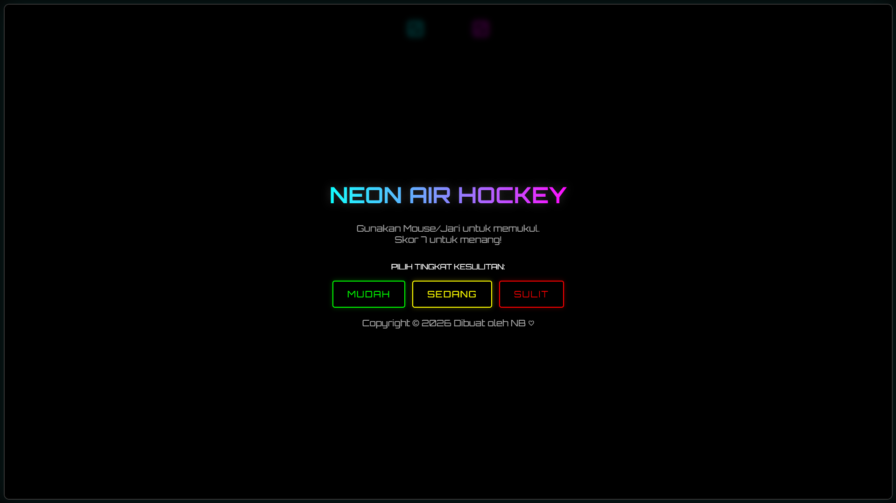

# Neon Air FX - Hoki Udara 🏒✨

Game Air Hockey berbasis web dengan tema modern neon, dibangun menggunakan HTML5 Canvas dan JavaScript murni. Game ini sepenuhnya self-contained dalam satu file HTML, ringan, responsif, dan memiliki efek suara sintesis (offline).

# 🌟 Fitur

- Tema Neon Modern: Visual glow yang menarik dengan efek partikel saat terjadi tabrakan.
- Responsif: Dapat dimainkan menggunakan Mouse (Desktop) atau Sentuhan Jari (Mobile/Tablet).
- Kecerdasan Buatan (AI): Lawan komputer yang menantang.
- 3 Tingkat Kesulitan: Mudah, Sedang, dan Sulit (mempengaruhi kecepatan bola dan AI).
- Audio Offline: Efek suara dihasilkan secara real-time menggunakan Web Audio API (tanpa file mp3 eksternal).
- Sistem Pause: Jeda permainan kapan saja.
- Single File: Seluruh kode (HTML, CSS, JS) berada dalam satu file index.html.

# 🚀 Cara Menjalankan (Lokal)

Karena game ini hanya terdiri dari satu file, Anda tidak perlu menginstall dependencies apa pun.
1. Clone repositori ini atau download file index.html.
2. Buka file index.html langsung menggunakan browser modern apa saja (Chrome, Firefox, Edge, Safari).
3. Selamat bermain!

Ikuti instruksi di layar, dan Vercel akan otomatis mendeteksi file statis tersebut.

# 🎮 Kontrol

- Desktop: Gerakkan mouse untuk mengendalikan pemukul (paddle) berwarna biru.
- Mobile: Sentuh dan geser jari di layar untuk menggerakkan pemukul.
- Tujuan: Cetak 7 gol ke gawang lawan untuk menang!

# 🛠️ Teknologi

- HTML5 Canvas
- CSS3 (Flexbox & Animations)
- Vanilla JavaScript (ES6+)
- Web Audio API

# 📝 Lisensi

Proyek ini bersifat open-source dan bebas digunakan untuk pembelajaran atau modifikasi.